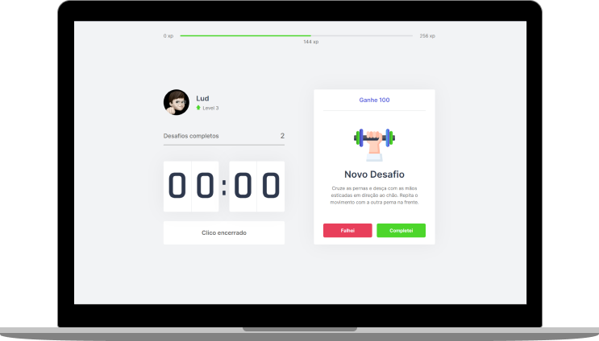

  

   

   
  </a>

  

## 🚀 Tecnologias

- [React](https://reactjs.org)
- [TypeScript](https://www.typescriptlang.org/)
- [Next.js](https://www.nextjs.org//)

## 💻 Projeto

O move.it é um app que une a técnica de Pomodoro com a realização de exercícios físicos para quem passa muito tempo na frente do computador.

## ⚙ Como executar

- Clone o repositório
- Instale as dependências com `yarn`
- Inicie o servidor com `yarn dev`

Agora você pode acessar [`localhost:3000`](http://localhost:3000) do seu navegador.

Feito com ♥ by heylud(Ana) 👋
